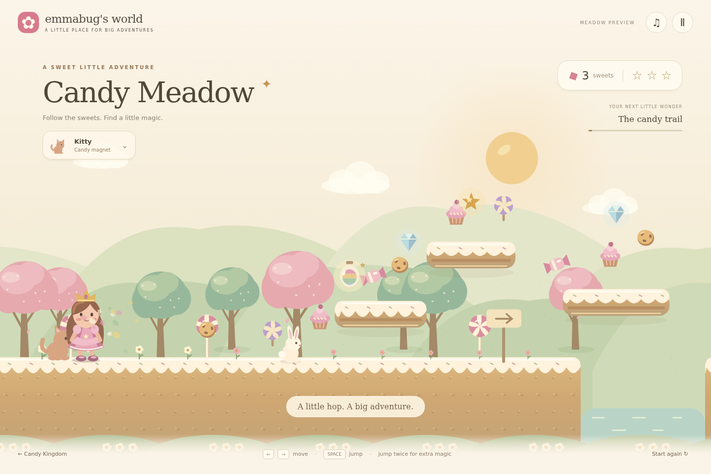

# Candy Kingdom revamp

## Release status — September 7, 2026

All five implementation slices are integrated at `/candy/`. The original game is
preserved at `/candy/classic.html`. The release includes four adventures, improved
art and fixed-step physics, eight pets, nine outfits, collecting and counting
doors, a 14-item room decorator, a seven-sticker land builder, five-person family
play, save migration, and offline packaging for all three worlds.

The 39 automated checks and desktop/phone browser checks pass. Real WebRTC
sessions verified the five-player cap, shared sweets, reactions, custom lands,
and disconnect recovery. Migration preserves the original save and an exact
backup. No paid assets or services were added. Physical-device play and public
internet connectivity still need real-world use; browser tests used emulation
and a local signaling server. GitHub Pages publishes the release from `main`.

See [the release guide](../candy/preview/README.md) for launch instructions,
controls, source files, save details, and validation limits. The slices below
record the original plan and earlier progress.

## Direction

Revamp Candy Kingdom for Emma, age six. Keep the friendly princess adventure,
collecting, pets, building, math doors, and playing with family. Aim for a cohesive
storybook candy world with expressive characters and forgiving, predictable motion.

Work one playable slice at a time: define the change, build it, check it, play it
together, and record what needs tuning. This document is the roadmap and checklist;
no separate process framework is needed.

## Starting point (before the revamp)

- `candy/index.html` contains the game, rendering, levels, controls, saves, builder,
  room, and PeerJS multiplayer in one file.
- Four authored levels: Candy Meadow, Berry Starlight, Chocolate River, Rainbow Peaks.
- Canvas artwork already includes layered scenery and a drawn princess. Improve the
  art as a coherent set rather than merely adding more particles.
- Movement already has acceleration smoothing, double jumps, a brief grace period
  after leaving an edge, moving platforms, trampolines, and pet powers.
- Physics uses a variable frame interval capped at 33 ms. Jump presses are consumed
  immediately; there is no landing buffer. These are useful first improvement seams.
- Progress is stored under `emmabug-candy-progress`; the shared service worker
  supports offline play. Existing local edits in Candy Kingdom and `sw.js` predate
  this plan and must be preserved.

## Playable slices

### 1. Candy Meadow preview — prove the look and feel

Build a separate `/candy/preview/` route with its own save namespace. Make a short,
complete course: start, collect candy, cross a gap, ride a moving platform, bounce
on a gumdrop, reach a castle celebration. Start from the existing mechanics and
character identity. Keep the current game available while the preview develops.

Visual direction: soft storybook depth, biscuit platforms with readable icing
edges, rounded candy trees, a recognizable princess, warm light, and restrained
sparkles. Add run/jump/land poses, gentle landing squash, contact shadows, and a
camera that eases into motion without hiding the next landing.

Movement: fixed simulation steps, responsive acceleration and braking, buffered
jumps shortly before landing, the existing edge grace and double jump, reliable
moving-platform carry, and a cheerful return after falling. Keep generous default
jumps; short-hop behavior should only stay if it helps Emma.

Extract only the input, movement, and rendering pieces needed for this slice. Use
the current Canvas approach initially; judge the result before committing to an
engine migration. Prefer code-drawn scenery and a small reusable asset set.

**Done when:** the course plays from start to celebration with keyboard and touch;
left/right plus jump works simultaneously; switching tabs never leaves movement
stuck; a missed jump returns Emma safely. Jump reach and landing outcomes agree
at simulated 30, 60, and 120 Hz rendering rates. The old save remains untouched.
Play on Emma's device to judge responsiveness, readability, and camera comfort.

### 2. Finish the character and interaction artwork

Extend the visual treatment to princess outfits, pets, gummy friends, grumps,
candy, stars, springs, and the castle. Give each interaction clear feedback:
candy pops toward the counter, springs compress before release, pets react,
and the castle celebrates. Keep collision shapes stable as art animates.

**Done when:** each object is recognizable at phone size; Emma can distinguish
what to collect, stand on, and bounce on without instructions. Test all pet powers
against the new movement, especially high jump, glide, speed, and triple jump.

### 3. Rebuild the four adventures

Apply the new style and movement across Candy Meadow, Berry Starlight, Chocolate
River, and Rainbow Peaks, one level at a time. Give each a distinctive palette,
scenery, and a few memorable moments. Tune gaps and star paths using measured
jump reach. Introduce mechanics gently, with optional harder routes to treasures.

**Done when:** each castle is reachable without a pet power; every star is
reachable by its intended route; falling always recovers; math doors retain
encouragement and correct progression. Completing and reopening a level preserves
its rewards. Each completed level is its own playable checkpoint.

### 4. Bring the whole play space together

Refresh the start screen, level selection, wardrobe/shop, pet selection, room,
and builder using the same visual language. Use large controls, recognizable
icons, and little reading. Reuse the actual platform and object artwork in the
builder so homemade lands look like the adventure.

**Done when:** Emma can start a level, change an outfit, select a pet, decorate
her room, and build then play a land. Existing purchases, progress, room layouts,
and custom lands survive a tested save migration. Preview saves stay separate
until that migration is deliberately implemented.

### 5. Family play and release

Carry the refreshed characters and animation into private family rooms. Verify
the existing invite flow, five-player cap, shared candy, reactions, and custom
land sharing. Smooth remote movement independently of local physics.

Package the new assets for offline use, test updating from the old cached game,
and switch `/candy/` to the revamp after the preview is ready. Keep a usable legacy
route for rollback; do not erase old save data.

**Done when:** two devices can join and play together, disconnecting leaves solo
play usable, and a five-player session respects the cap. On the target device,
check portrait/landscape, sound, pause/resume, saved progress, and offline relaunch
after an initial online visit. Verify that service-worker changes also preserve
Unicorn World and Sea World.

## How we keep this manageable

- Implement slice 1 first. Use the playable result to settle the art direction
  and movement tuning before expanding the revamp.
- Within a slice, make small changes with a working game at each checkpoint.
- Add focused movement tests for jump timing, platform collisions, and frame-rate
  independence. Use play checks for artwork and feel rather than screenshot tests
  that merely freeze the implementation.
- Keep static hosting, offline solo play, private family multiplayer, and the
  no-fail spirit. New services and new game modes are outside this revamp.
- Track completion here with a short note and validation evidence per slice.
  See the progress notes below for implementation status.

## Progress — 2026-09-06

Slice 1 is implemented at `/candy/preview/`, with a short complete course, original
Canvas artwork, keyboard and simultaneous touch controls, fixed-step movement,
buffered/double jumps, moving-platform carry, springs, recovery, and a castle
celebration. Preview personal bests have a separate save key. The existing game
and shared service worker were not edited.

Validation: eight physics checks pass, including equal simulation results at
30/60/120 Hz rendering rates and completing the course without pet powers.
Playwright passed a desktop full-course run, pause/resume, blur cleanup, restart,
save isolation, and touch-emulated simultaneous movement/jumping. Portrait and
landscape screenshots were reviewed; no browser runtime errors were reported.
The run instructions and check details are in `candy/preview/README.md`.

Still to validate: play on Emma's actual device, judge comfort and readability,
and tune the art and movement from that feedback before starting slice 2.

## Items and powers increment — 2026-09-06

Added six familiar pets with working powers and original Canvas companion art:
Kitty (magnet), Bunny (high jump), Pengy (speed), Flutter (hold-jump glide), Draggy
(triple jump), and Sparkle (double-value lollipops). The pet menu pauses the game,
allows free switching, remembers the selected friend, and shows the treasure bag.

Expanded the course to 40 treats across four types, six gems, two chests, three
12-second rainbow-magnet bottles, and a Meadow Helper badge for finding 12 treats.
Chests award five bonus sweets. The score counts sweet value; the treasure bag
separately tracks the number of treats found. Restart clears run rewards and
keeps the chosen pet. All existing save isolation remains in place.

Thirteen simulation/adventure checks pass. This increment covers the first pets
and collectibles portion of slice 2; outfits, grumps, and the broader four-level
rollout are still future work.

Cost constraint: keep the game local/static with no new paid services or purchased
assets. Explain any proposed paid dependency before using it. Account-level Codex
usage and remaining allowance are not visible to the coding agent.

Browser validation for this increment passed all six pet selections and saved
choice restoration, desktop full-course completion, original-save isolation,
and simultaneous touch controls with Flutter. Desktop and phone pet-menu artwork
was reviewed; the final menu uses the game's drawn portraits rather than emoji.

## Dress-up and meadow friends increment — 2026-09-06

Added four free outfit choices with matching drawn portraits: Rose Princess,
Moonbeam, Garden Fairy, and Buttercup. Friends and Dress-up share a paused chooser;
pet and outfit choices persist together without touching the original game save.
Outfits retain the princess's collision geometry and movement.

Three gummy bears now greet Emma and reward collecting goals of 6, 12, and 24
treats with five bonus sweets each. Their speech bubbles show progress and readiness;
visiting a ready bear completes its goal without spending treats. Four wandering
grumps provide a gentle bounce and three sweets on their first bop. Repeated bops
remain playful but do not pay again; side contact only makes them huff. Restart
resets the run's goals and rewards.

Seventeen simulation/adventure tests pass, including reward uniqueness, harmless
side contact, and safe default outfits for existing preview saves. The next major
roadmap slice remains bringing this treatment to all four adventures.

## Four-adventure increment — 2026-09-06

Expanded the preview to Candy Meadow, Berry Starlight, Chocolate River, and Rainbow
Peaks with authored layouts, distinct scenery, moving platforms, and optional
climbing routes to three stars per world. A responsive adventure map makes every
world available immediately. Per-world personal bests and completion are preserved,
along with the last adventure, selected pet, and outfit. Earlier preview saves
load as Candy Meadow records without inventing completed levels.

Castle doors now offer small visual counting questions, encouraging retries, and
an optional magic skip. Opening a door records completion and offers the next
adventure. Merely arriving at the castle does not record a completed adventure.

Thirty-three automated checks pass. Each castle has a tested no-powers route
without a rescue; all stars are reachable in simulation from nearby platforms.
Browser checks passed all four world selections, rendering and movement, last-world
restoration, original-save isolation, and phone map/wardrobe layouts.

The next roadmap work is the room and builder, then family-play integration and
offline/release packaging. The preview remains separate from the existing game.
